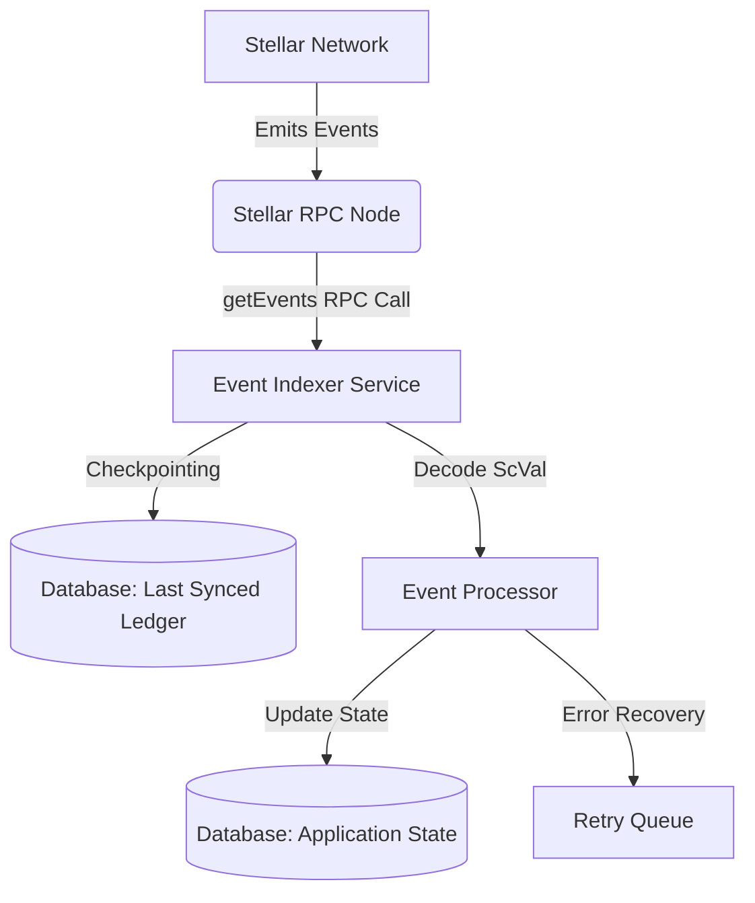

# Soroban Event Indexer Architecture

## Overview

The Soroban Event Indexer is a critical background service that keeps the off-chain database synchronized with on-chain Soroban contract states. It polls the Stellar RPC node for emitted events, decodes the `ScVal` data, and updates the local database accordingly.

### Architecture Diagram

## Event Topic Structures

The indexer filters and listens to specific topics from various smart contracts.

### 1. Invoice Escrow Contract (`invoice-escrow`)
Topics emitted during the escrow lifecycle:
- `["escrow", "initialized"]`: Triggered when a new invoice is escrowed.
  - Data: `Invoice ID`, `Amount`, `Payer`, `Payee`
- `["escrow", "released"]`: Triggered when funds are released to the payee.
  - Data: `Invoice ID`, `Transaction Hash`
- `["escrow", "refunded"]`: Triggered when funds are returned to the payer.
  - Data: `Invoice ID`, `Reason`

### 2. Invoice Token Contract (`invoice-token`)
Topics emitted for tokenized invoices:
- `["token", "minted"]`: Triggered when invoice tokens are minted.
  - Data: `Token ID`, `Amount`, `Owner`
- `["token", "transferred"]`: Triggered on token transfer.
  - Data: `Token ID`, `From`, `To`, `Amount`
- `["token", "burned"]`: Triggered when tokens are burned upon settlement.
  - Data: `Token ID`, `Amount`

### 3. Payment Distributor Contract (`payment-distributor`)
Topics related to distributing yields or payments:
- `["payment", "distributed"]`: Triggered when a batch of payments is distributed.
  - Data: `Batch ID`, `Total Amount`, `Recipients Count`
- `["payment", "failed"]`: Triggered when a specific payment fails.
  - Data: `Recipient`, `Amount`, `Error Code`

### 4. Integration ACL, creator keys, curve migrations and atomic swaps

Topics consumed by the read models exposed under `/api/v1/keys`, `/api/v1/swaps` and
`/api/v1/admin/acl`. Each topic is handled by a `ContractEventHandler` registered on
`ContractEventBus` (see `src/services/contract-event-bus.service.ts`), which
`EventIndexerService` dispatches to after the event is logged. A handler failure is
logged and skipped, so one bad projection never blocks the rest of the pipeline.

- `["key_config_updated", key_id]`: new per-key buy caps and supply. Updates
  `creator_keys` and invalidates the 60s buy-limit cache.
- `["acl_updated", contract_address]`: whitelists (`action: "add"`, with
  `permitted_functions`) or removes (`action: "remove"`) an integration contract.
  Upserts `contract_acls`, appends to `contract_acl_logs`, and invalidates the 5m
  ACL cache.
- `["curve_migration_proposed", key_id, proposal_id]`: a bonding-curve migration
  proposal with its parameters and timelock. Recorded as `pending` until the
  matching execution event arrives.
- `["curve_migration_executed", proposal_id]`: applies the migration, stamps
  `executed_at` and applied parameters, and emits an admin notification.
- `["atomic_swap_executed", buyer, seller, swap_id]`: a direct invoice-for-invoice
  exchange. Records both sides, both amounts, and the fee, indexed by buyer and by
  seller.

Projections are idempotent on their on-chain identifier, so replaying a ledger range
cannot create duplicate rows.

## Last-Synced Ledger Checkpointing

To ensure no events are missed and to prevent processing duplicate events, the indexer relies on a checkpointing mechanism:

1. **Polling**: The indexer queries the RPC `getEvents` endpoint using a ledger range (e.g., `startLedger` to `endLedger`).
2. **Checkpointing**: After successfully processing all events up to `endLedger`, the indexer saves `endLedger` to the database as the `last_synced_ledger`.
3. **Resume**: On restart, the indexer queries the database for `last_synced_ledger` and resumes polling from `last_synced_ledger + 1`.

## Failure Recovery Procedures

The indexer is designed to handle temporary failures and RPC limits:

- **RPC Rate Limiting**: If a `429 Too Many Requests` error occurs, the indexer applies exponential backoff before retrying the `getEvents` call.
- **Ledger Gap Recovery**: If the `startLedger` is too far behind (e.g., beyond the RPC node's retention window), the system alerts administrators for manual intervention or falls back to an archive node.
- **Processing Failures**: If event decoding or database updates fail for a specific event, the indexer logs the error, places the event in a Dead Letter Queue (DLQ) for manual inspection, and continues processing subsequent events to avoid blocking the pipeline.
