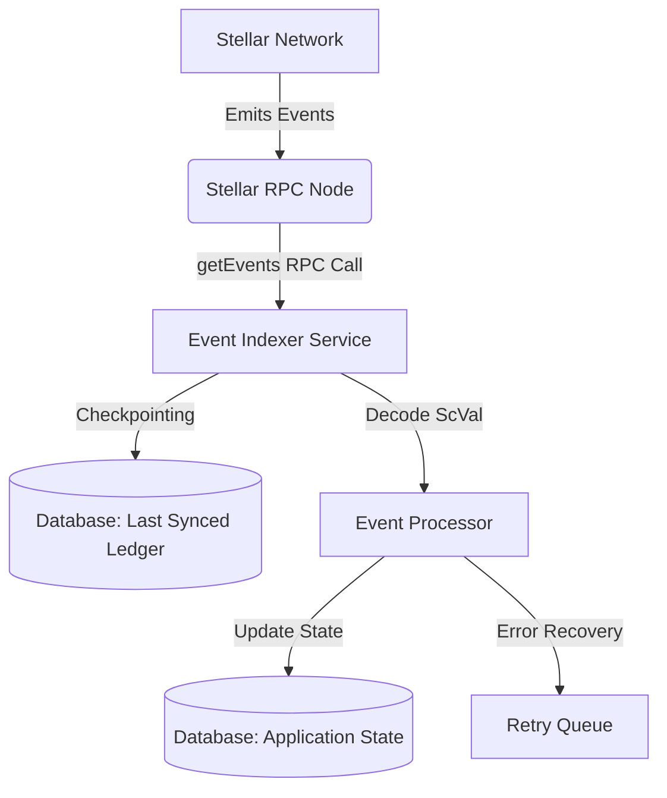

# Soroban Event Indexer Architecture

## Overview

The Soroban Event Indexer is a background service that keeps the off-chain database synchronized with on-chain Soroban contract states. It polls the Soroban RPC `getEvents` endpoint, decodes the `ScVal` data, and updates the local database accordingly. Horizon does not expose Soroban contract events.

### Architecture Diagram

## Event Topic Structures

The indexer filters and listens to specific topics from various smart contracts.

### 1. Invoice Escrow Contract (`invoice-escrow`)
Topics emitted during the escrow lifecycle:
- `["escrow", "initialized"]`: Triggered when a new invoice is escrowed.
  - Data: `Invoice ID`, `Amount`, `Payer`, `Payee`
- `["escrow", "released"]`: Triggered when funds are released to the payee.
  - Data: `Invoice ID`, `Transaction Hash`
- `["escrow", "refunded"]`: Triggered when funds are returned to the payer.
  - Data: `Invoice ID`, `Reason`

### 2. Invoice Token Contract (`invoice-token`)
Topics emitted for tokenized invoices:
- `["token", "minted"]`: Triggered when invoice tokens are minted.
  - Data: `Token ID`, `Amount`, `Owner`
- `["token", "transferred"]`: Triggered on token transfer.
  - Data: `Token ID`, `From`, `To`, `Amount`
- `["token", "burned"]`: Triggered when tokens are burned upon settlement.
  - Data: `Token ID`, `Amount`

### 3. Payment Distributor Contract (`payment-distributor`)
Topics related to distributing yields or payments:
- `["payment", "distributed"]`: Triggered when a batch of payments is distributed.
  - Data: `Batch ID`, `Total Amount`, `Recipients Count`
- `["payment", "failed"]`: Triggered when a specific payment fails.
  - Data: `Recipient`, `Amount`, `Error Code`

## Last-Synced Ledger Checkpointing

To ensure no events are missed and to prevent processing duplicate events, the indexer relies on a checkpointing mechanism:

1. **Polling**: The indexer queries the Soroban RPC `getEvents` endpoint with configured contract IDs and follows its cursor through full pages.
2. **Event log**: Each event is retained in `soroban_event_logs`, keyed by contract and RPC event ID. Successfully processed entries are marked processed; failed entries remain retryable.
3. **Checkpointing**: After every returned page has been handled, the indexer stores the latest observed ledger in `soroban_indexer_checkpoints`, including when a ledger contains no matching events.
4. **Resume**: On restart, polling resumes at `last_synced_ledger + 1`. Duplicate event delivery is skipped using the unique contract/event key.

## Runtime Configuration

- `SOROBAN_EVENT_INDEXER_ENABLED`: enable the background poller (default `false`).
- `SOROBAN_EVENT_INDEXER_INTERVAL_MS`: poll interval in milliseconds (default `10000`).
- `SOROBAN_EVENT_INDEXER_LAG_THRESHOLD_LEDGERS`: log a warning at or above this ledger lag (default `1000`).
- `SOROBAN_ESCROW_CONTRACT_ID` and `SOROBAN_RPC_URL`: contract and Soroban RPC endpoint; both are required to start the poller.

## Failure Recovery Procedures

The indexer is designed to handle temporary failures and RPC limits:

- **RPC Rate Limiting**: If a `429 Too Many Requests` error occurs, the indexer applies exponential backoff before retrying the `getEvents` call.
- **Ledger Gap Recovery**: If the `startLedger` is too far behind (e.g., beyond the RPC node's retention window), the system alerts administrators for manual intervention or falls back to an archive node.
- **Processing Failures**: If event decoding or database updates fail for a specific event, the indexer logs the error, places the event in a Dead Letter Queue (DLQ) for manual inspection, and continues processing subsequent events to avoid blocking the pipeline.
