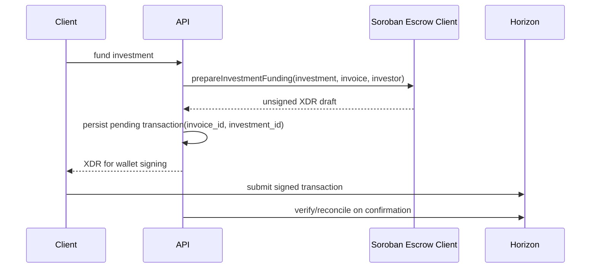

# Soroban Escrow Orchestration

This backend uses a wallet-signing model for Soroban escrow funding.

## Security model

- The server does **not** sign Soroban funding transactions.
- When `SOROBAN_ESCROW_ENABLED=true`, the backend prepares an XDR payload and
  records a pending transaction row linked to the relevant investment and invoice.
- Final DB confirmation still comes from Horizon verification and/or the
  reconciliation worker, not from the draft preparation call alone.

## Sequence

